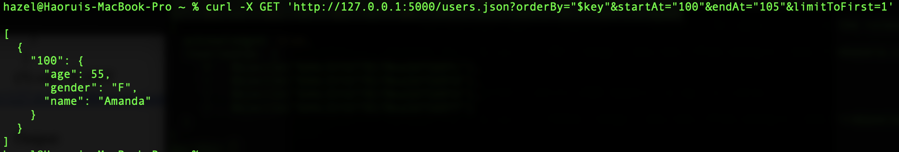

# Emulate Big Data System 

## Topic
The topic of this project is about using Python Flask and MongoDB to emulate Firebase.
The project would have a “users” database and users would be able to query or update the
content of the database in a terminal using curl commands like Firebase.

## Basic Information
The project implementation has three main parts: server API, MongoDB database, and
the command-line interface. The server is built on the Python Flask framework which would run on localhost(127.0.0.1) and listen to port 5000. The data are stored in the MongoDB database
which also ran on localhost(27017). To run this server, I first created a database named
“dsci551”, then created a collection named “users” under “dsci551”. (To run this server, you
would also need to set the same database and collection in MongoDB.) The project would
support a command-line interface that allows users to query or update data. The response of the
curl commands would be returned in the terminal in JSON format.

The basic workflow of this project is shown in the diagram below: 

The demo dataset used for testing in this project is in the "testset.txt" file.

## Implementation

This RESTful API would be able to support functions just like Firebase API, which
includes GET, PUT, PATCH, POST, DELETE, and filtering functions orderBy=$key,
orderBy=$value, orderBy=name(any key in the data), limitToFirst, limitToLast, equalTo, startAt,
and endAt. Here is the detailed implementation of each function.

In this readme file, we would take GET function and its filtering function as an example and introduce how the API works. If you want to check the implementation for each function in detail, please see in the "report.pdf" file.

**GET function**

The GET function would return the data under the specific key according to the curl
command in JSON format without showing the “_id” which is automatically created by
MongoDB.

The GET function is built in the “get_value” function in server.py. In the function, the
code would first check how many keys are indicated in the command, then it would use the
find() or find_one() function to get the corresponding data and return it in JSON format.

Test cases:

i.

ii.

**GET function with filtering functions
orderBy=”$key” with equalTo, startAt, endAt, limitToFirst, limitToLast**

The filtering functions could be used with GET. First, users could apply the orderBy $key
to order the data by keys in the dataset in ascending order. Then, users could also apply startAt
and endAt to set the range for keys. The equalTo is used to return the data with the same key
indicated in the command. Finally, the limitToFirst and limitToLast would limit the number of
data returned by the command to a specific number. The limitToFirst would start from the
beginning of the result and the limitToLast would start from the end.

The orderBy, equalTo, startAt, endAt, limitToFirst and limitToLast functions are all embedded in the “get_value” function. For the orderBy=”$key”, the key-value pairs within the data are first sorted according to the key. In order to handle the problem that the key might be a digit, string, or other types of data, I used the sort function and lambda function "key_ls.sort(key=lambda x: (isinstance(x, int), x) if isinstance(x, int) else (float('inf'), x))” to sort the keys. After that, we could write other filtering functions based on orderBy. For equalTo, it would iterate the keys and then find whether there is the same key as the command indicated. For startAt and endAt, it would first compare the key with the startAt and endAt, then slice the data according to the value. Finally, the limitToFirst and limitToLast would slice the data according to the index.

Test cases:

i.

ii.

iii.

iiii.

**orderBy=”$value” with equalTo, startAt, endAt, limitToFirst, limitToLast**

The orderBy $value would order the data by value in ascending order. Same as above,
after orderBy “$value”, users could apply other filtering functions in the command. The basic
use and implementation of these functions are the same as orderBy “$key”, except that “$value”
would sort by value and “$key” would sort by key. For example, from the first test cases below,
we can see that the data is ordered according to values (89, 90, 93, 95, 99, A, B, C).

Test cases:

i.

ii.

iii.

## Error handling

There are several error-handling processes are involved in this project. The below shows
the circumstances that might cause errors and the corresponding response from the terminal.

First, when the limitToFirst or limitToLast is negative, the terminal would return the
response: {"error": "limitToFirst/limitToLast must be positive"}. Second, when the command has
limitToFirst, limitToLast, equalTo, startAt, or endAt without orderBy, the terminal would return
{"error": "orderBy must be defined when other query parameters are defined"}. Third, when
limitToFirst and limitToLast are stated in one command at the same time, it would return
{"error": "Only one of limitToFirst and limitToLast may be specified". Finally, when the
command contains data that is not in the expected format, the terminal would return the response
{"error": "Invalid data; couldn't parse JSON object, array, or value."}

